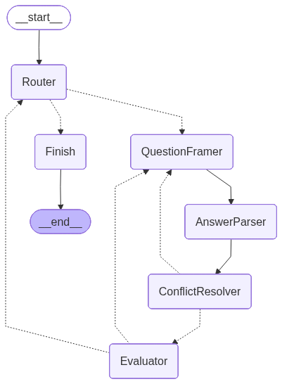
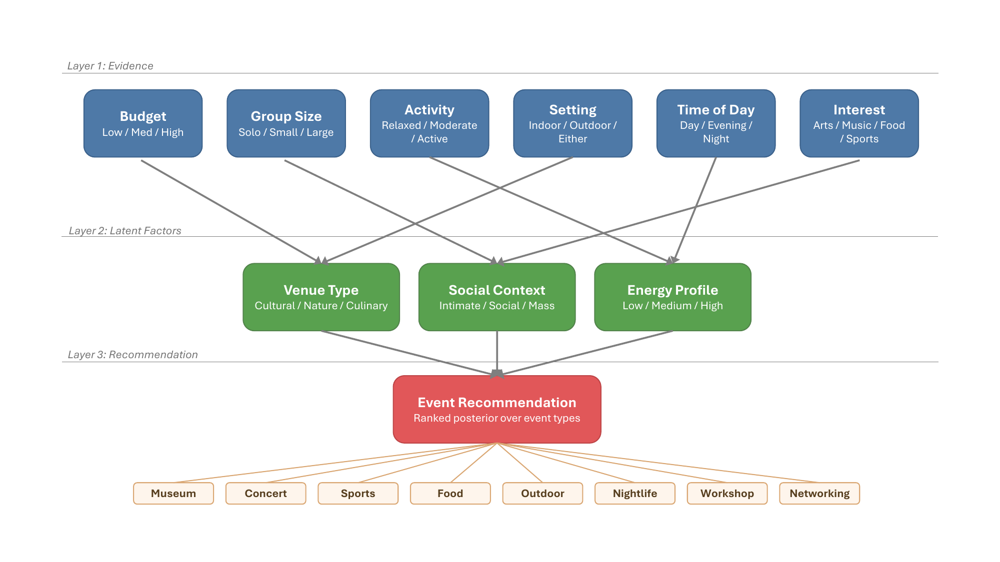

# JARVIS — Social Event Recommendation Agent on Pepper

> *"At your service. Scanning the local grid for maximum energy signatures."*

A socially interactive agent for the **Pepper** humanoid robot (running in the
**qiBullet** simulation) that recommends a social event to suit the person in
front of it. Pepper notices when someone approaches, greets them with
coordinated speech and gestures, holds a short natural conversation to learn what
kind of outing they're in the mood for, reasons over those preferences with a
transparent **Bayesian network**, and then recommends an event out loud — showing
the matching picture on its tablet and explaining *why* it chose it.

The system combines three ideas:

- a **finite-state interaction manager** that gives the encounter a clear,
  robust shape (greet → converse → reason → recommend → say goodbye);
- a **language model** that turns casual, free-form replies into structured
  preferences and asks open, human-sounding questions; and
- a **Bayesian network** that produces an explainable recommendation rather than
  a black-box answer.

---

## What a conversation looks like

```
(person steps into view)
Pepper:  Hello there!                         (waves)
Pepper:  Nice to see you.                      (nods)
Pepper:  I can recommend a social event for you. (opens both arms)

Pepper:  What kind of evening would actually make you feel recharged?
You:     something pretty laid back, not a big crowd
Pepper:  And when do you usually like to head out — daytime, or later on?
You:     evenings mostly
   ... (a few more open questions) ...

Pepper:  Let me think about that.             (thinking pose)
Pepper:  Based on what you told me, I recommend the following.
            1. Museum        34%
            2. Workshop      19%
            3. Food          15%
Pepper:  I suggest Museum because your preferences point to a cultural venue
         with an intimate vibe and a low-key feel.
         (the Museum image appears on Pepper's tablet)

Pepper:  Have a great time! Goodbye.          (waves)
```

---

## How it works

The agent is built from a few cooperating components, coordinated by a six-state
interaction loop.

### 1. The interaction loop (state machine)

```
Idle → Greeting → Conversation → Reasoning → Recommendation → Farewell → Idle
```

- **Idle** — passively watches the camera until a face is *stably* present for
  several consecutive frames (smoothing avoids false triggers).
- **Greeting** — three coordinated beats; each spoken line starts together with
  its gesture and the robot waits for both to finish (wave → nod → open arms).
- **Conversation** — runs the dialogue to collect the user's preferences.
- **Reasoning** — a "let me think" pose while the Bayesian network ranks events.
- **Recommendation** — speaks the top events, shows the winning event's image on
  the tablet, and explains the reasoning.
- **Farewell** — says goodbye and resets, ready for the next person.

The loop is deliberately fault-tolerant: if the person walks away at any point it
returns to Idle, and if the recommendation comes back weak or empty it still
presents the best available options (or apologises gracefully).

### 2. Perception

Face detection uses an OpenCV Haar cascade over a camera feed (the local webcam,
or Pepper's simulated head camera). Detections are smoothed over a short window
so a face must persist before it counts as "present", and presence is tracked
with a looser threshold so brief dropouts don't end the interaction. Perception
can run on a background thread so the live preview window stays responsive while
the robot is busy talking.

### 3. The dialogue

Instead of reading a fixed script, the dialogue is a small **graph of named
agents** that decide what to ask next and how to interpret the answer:



- **Router** — picks the next preference still unknown (or finishes).
- **QuestionFramer** — asks about it with an *open, experiential* question
  generated by the language model (e.g. "what kind of evening would recharge
  you?") rather than listing options. On a retry it rephrases.
- **AnswerParser** — maps the free-form reply to one or more concrete
  preferences, and ignores vague or merely agreeable replies ("great", "sure")
  instead of guessing.
- **ConflictResolver** — if a new answer contradicts something already decided,
  it re-opens that preference and asks a short either/or question to settle it.
- **Evaluator** — judges whether the answer was usable: commit and move on,
  rephrase and ask again, or fall back to a sensible default after a couple of
  tries so the conversation never stalls.

The language model runs on **Groq** (free, open models such as Llama 3.3) through
an OpenAI-compatible API. Every value the model produces is passed through a
**whitelist** before it can influence the recommendation, so only legal
preference values ever reach the reasoning engine. If the model is unavailable,
a deterministic keyword parser takes over so the agent still works offline.

The six preferences the conversation tries to learn:

| Preference | Possible values |
|---|---|
| Budget | Low · Med · High |
| Group size | Solo · Small · Large |
| Activity level | Relaxed · Moderate · Active |
| Setting | Indoor · Outdoor · Either |
| Time of day | Day · Evening · Night |
| Interest | Arts · Music · Food · Sports |

A conversation never has to fill all six — the reasoning engine works with
partial information.

### 4. The reasoning engine (Bayesian network)

Recommendations come from a small, explainable three-layer Bayesian network built
with **pyAgrum**:



Each pair of observed preferences drives one interpretable latent factor — *what
kind of venue, how social, how energetic* — and those three factors together
produce a probability distribution over eight events:

> **Museum · Concert · Sports · Food · Outdoor · Nightlife · Workshop · Networking**

The conditional probability tables are generated from soft, human-readable rules
rather than hand-tuned numbers, which keeps them consistent and makes the result
explainable. Inference returns the events ranked by probability, and an
`explain()` step reads back the most likely latent factors to phrase the *because…*
sentence Pepper says aloud. Unobserved preferences simply fall back to their
priors.

### 5. Voice and presence

- **Speech output** uses neural text-to-speech (`edge-tts`, a natural-sounding
  voice) with an offline `pyttsx3` fallback, so the robot doesn't sound flat and
  monotone. Speech and gestures are launched together and synchronised.
- **Speech input** (optional) uses a **local Whisper** model
  (`faster-whisper`) that runs entirely on-device — on the GPU when a CUDA build
  is available, otherwise on the CPU — so the user can simply talk back.
- **Tablet image** — when Pepper presents a recommendation, the matching event
  picture is shown on a thin textured panel pinned to Pepper's tablet (it tracks
  the tablet link as the robot moves), and is cleared at the end of each
  interaction. If the simulator surface isn't available it falls back to a
  desktop preview window.

### 6. Two runtimes, one agent

The robot side (perception, behaviour, reasoning) targets **Python 3.8** for
qiBullet / NAOqi compatibility, while the dialogue runs on **Python 3.11**
(required by LangGraph). They live in two separate environments and are connected
by a small **bridge**: the robot spawns the dialogue as a subprocess and they
exchange newline-delimited JSON over stdio. The robot owns the voice and the
camera; the dialogue owns the language understanding. If the dialogue can't be
started, the robot falls back to a console stand-in so a demo still runs.

---

## Project layout

```
Social-Event-Recommendation-Agent-on-Pepper-using-LangGraph-and-pyAgrum-BayesNet/
├── src/                         # robot side (Python 3.8)
│   ├── main.py                  # entry point / orchestrator
│   ├── state_machine.py         # six-state interaction loop
│   ├── contracts.py             # shared preference/result types + interfaces
│   ├── dialogue_bridge.py       # client that drives the dialogue subprocess
│   ├── perception/              # Haar face detection + camera sources
│   ├── behaviour/               # speech (TTS), gestures, tablet image display
│   └── recommender/             # pyAgrum Bayesian network
├── dialogue/                    # dialogue service (Python 3.11, own uv project)
│   └── dialogue/
│       ├── graph.py             # the agent graph (Router/QuestionFramer/…)
│       ├── llm.py               # Groq language-model parser + question framer
│       ├── asr.py               # local Whisper speech-to-text
│       ├── manager.py           # runs the graph and returns preferences
│       └── bridge.py            # subprocess side of the JSON-stdio bridge
├── imgs/                        # event images shown on Pepper's tablet
└── Proposal/                    # project proposal (LaTeX + figures)
```

---

## Setup

Both sides are managed with [uv](https://docs.astral.sh/uv/).

```bash
git clone git@github.com:SuneshSundarasami/Social-Event-Recommendation-Agent-on-Pepper-using-LangGraph-and-pyAgrum-BayesNet.git
cd Social-Event-Recommendation-Agent-on-Pepper-using-LangGraph-and-pyAgrum-BayesNet

# robot side (Python 3.8)
uv sync

# dialogue side (Python 3.11) — only needed for the real dialogue
cd dialogue
uv sync                 # core graph + language model
uv sync --extra speech  # add this for spoken input (local Whisper)
```

### API key and tracing

The dialogue language model needs a free **Groq** API key. Put it (and, if you
want LangSmith tracing of the conversation) in `src/.env` (at the repo root):

```ini
GROQ_API_KEY="gsk_..."           # free key from console.groq.com

# optional — trace the dialogue graph at smith.langchain.com
LANGSMITH_API_KEY="lsv2_..."
LANGSMITH_TRACING="true"
LANGSMITH_PROJECT="dialogue"
```

---

## Running

```bash
# from the repo root (the cloned folder)
cd Social-Event-Recommendation-Agent-on-Pepper-using-LangGraph-and-pyAgrum-BayesNet

# Headless demo — no camera, no simulator, one full interaction cycle:
uv run python src/main.py --source scripted

# Local webcam face detection with an interactive console conversation:
uv run python src/main.py --source webcam --interactive

# Pepper in the qiBullet GUI, seeing through its own head camera:
uv run python src/main.py --source pepper

# Full pipeline — the real language-model conversation (Pepper speaks each
# question, you type the answer), then a Bayesian recommendation:
uv run python src/main.py --source scripted --dialogue real

# Fully spoken & embodied — Pepper in the GUI asks out loud (neural voice),
# you answer out loud (local Whisper), webcam face detection:
uv run python src/main.py --source hybrid --dialogue real --answer speech
```

Key options:

| Option | Choices | Meaning |
|---|---|---|
| `--source` | `scripted` · `webcam` · `pepper` · `hybrid` | where face detection comes from / whether Pepper is spawned |
| `--dialogue` | `stub` · `real` | console stand-in vs. the real language-model graph |
| `--answer` | `text` · `speech` | typed replies vs. spoken (local Whisper) |
| `--preview` | flag | show the webcam window with detection boxes |
| `--interactive` | flag | ask on the console instead of using defaults (stub dialogue) |

### Voice configuration (environment variables)

| Variable | Default | Notes |
|---|---|---|
| `TTS_BACKEND` | `auto` | `edge` (neural) · `pyttsx3` (offline) · `none` |
| `TTS_VOICE` | `en-GB-RyanNeural` | any Edge neural voice |
| `TTS_RATE` | `-8%` | Edge neural speaking-rate offset (e.g. `-8%`, `+10%`) |
| `TTS_PITCH` | `-5Hz` | Edge neural pitch offset (e.g. `-5Hz`, `+10Hz`) |
| `WHISPER_MODEL` | `large-v3` on GPU, `small` on CPU | `tiny`/`base`/`small`/`medium`/`large-v3`; `large-v3` fits a 6 GB GPU with `int8_float16` (≈2.2 GB) |
| `WHISPER_DEVICE` | `auto` | `cuda` / `cpu` (auto-detects a GPU) |
| `WHISPER_COMPUTE` | `int8_float16` on GPU, `int8` on CPU | `float16` / `int8_float16` / `int8`; `int8_float16` keeps headroom for the qiBullet sim |
| `WHISPER_MIC_INDEX` | — | input device index if the default mic is wrong |

Neural TTS uses the network; local Whisper runs on-device. For a fully offline
run set `TTS_BACKEND=pyttsx3`.

### Inspecting the dialogue (optional)

The conversation graph can be opened interactively in **LangGraph Studio**:

```bash
cd dialogue          # from the repo root
uv run langgraph dev
```

and, if `LANGSMITH_*` is configured, every run is traced at
[smith.langchain.com](https://smith.langchain.com).

---

## Tech stack

- **qiBullet / PyBullet** — Pepper simulation, joint control, tablet texture
- **OpenCV** — Haar-cascade face detection
- **LangGraph** — the multi-agent dialogue graph
- **Groq** (Llama 3.3) — language understanding and question framing
- **faster-whisper** — local, on-device speech-to-text (GPU/CPU)
- **edge-tts / pyttsx3** — neural and offline speech output
- **pyAgrum** — the explainable Bayesian recommendation network
- **uv** — environment and dependency management
