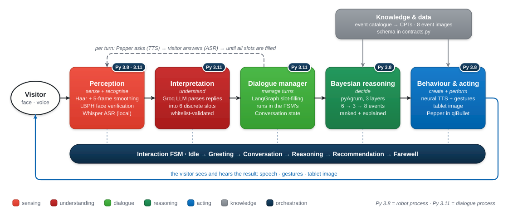
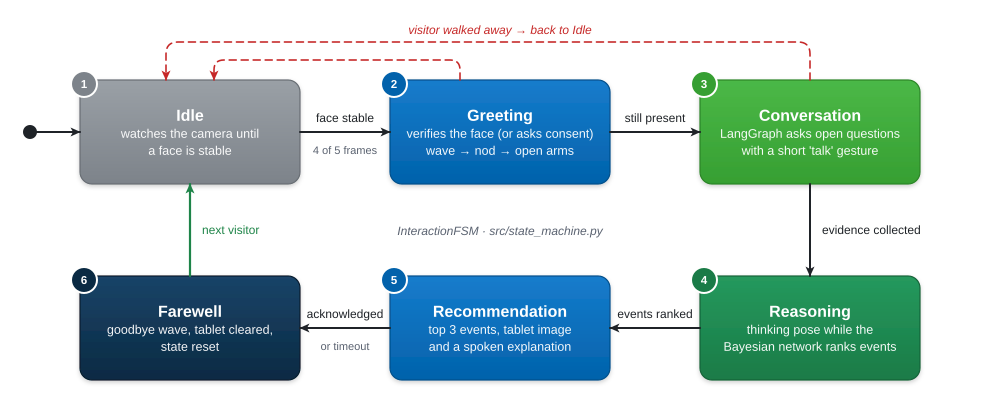

<div align="center">

# Social Event Recommendation Agent for the Pepper Robot

*Face perception, an LLM-driven conversation and an explainable Bayesian network,<br/>
running on Pepper in the qiBullet simulator*


[Overview](#overview) ·
[Demo](#demo) ·
[Architecture](#architecture) ·
[Quick start](#quick-start) ·
[Documentation](#documentation)

</div>

---

## Overview

This agent runs on the **Pepper** humanoid robot (in the **qiBullet** simulator) and
recommends a social event to the person standing in front of it.

When someone approaches, Pepper recognises their face, greets them with
coordinated speech and gestures, and asks a few open questions about what kind
of outing they are in the mood for. A **Bayesian network** then ranks eight
event types. Pepper says its recommendation out loud, shows a matching picture
on its tablet, and explains *why* it chose it.

The design rule throughout: **the user speaks naturally, but the decision stays
inspectable.**

| | Capability | How |
|---|---|---|
| **Sees** | Notices a visitor and recognises returning faces | OpenCV Haar cascade with temporal smoothing, LBPH face verification |
| **Listens** | Understands free-form typed or spoken replies | Local Whisper ASR, Groq-hosted LLM parser |
| **Converses** | Asks open, varied questions and handles vague or contradictory answers | LangGraph multi-agent slot-filling graph |
| **Reasons** | Produces an explainable, ranked recommendation | 3-layer pyAgrum Bayesian network |
| **Acts** | Speaks, gestures and shows the result | Neural TTS, Pepper joint control, tablet texture |
| **Stays safe** | Keeps LLM output legal, asks consent before storing faces, filters abuse | Three-layer whitelist, consent-gated enrollment, abuse filter |

---

## Demo

| Recording | Content |
|---|---|
| [`demo/Final_Demo_SERA.mp4`](demo/Final_Demo_SERA.mp4) | A full end-to-end encounter with Pepper in qiBullet |
| [`demo/Final_SERA_langgraph.mp4`](demo/Final_SERA_langgraph.mp4) | The dialogue graph running, as seen in LangGraph |

<details>
<summary><b>Sample conversation transcript</b></summary>

```text
(a person steps into view; their face is checked against known visitors)
Pepper:  Greetings, Sunesh. JARVIS online, at your service.       (waves)
Pepper:  Systems nominal. It's good to see you.                   (nods)
Pepper:  Scanning the local grid for a social event to suit you.  (opens both arms)

Pepper:  Will it just be you this evening, or is anyone joining you?
You:     just me, keeping it simple
Pepper:  What kind of pace suits you tonight: relaxed, or something livelier?
You:     pretty relaxed
   ... a few more open questions; their order and wording change every run ...

Pepper:  Let me think about that.                                 (thinking pose)
Pepper:  Based on what you told me, I recommend the following.    (presents)
            1. Museum        41%
            2. Workshop      19%
            3. Food          11%
Pepper:  I suggest Museum because your preferences point to a cultural venue
         with an intimate vibe and a low-key feel.
         (the Museum image appears on Pepper's tablet)

Pepper:  Enjoy your evening. JARVIS signing off, goodbye.         (waves)
```

The robot's persona introduces itself as *JARVIS*. If it doesn't recognise the
visitor, it first asks their name and whether it may remember their face. If a
reply is abusive, it politely asks the person to rephrase instead of parsing it.

</details>

---

## Architecture

The agent is a single processing route, from perception to action. It is split
across **two Python runtimes**: qiBullet needs Python 3.8, while LangGraph needs
Python 3.9 or newer. The two processes exchange newline-delimited JSON over
stdio.

<p align="center">
  <picture>
    <source media="(prefers-color-scheme: dark)" srcset="docs/diagrams/architecture-dark.svg">
    
  </picture>
</p>

### Interaction lifecycle

Each encounter follows a six-state machine.

<p align="center">
  <picture>
    <source media="(prefers-color-scheme: dark)" srcset="docs/diagrams/lifecycle-dark.svg">
    
  </picture>
</p>

### What the agent learns and recommends

<p align="center">
  <picture>
    <source media="(prefers-color-scheme: dark)" srcset="docs/diagrams/bayesian-network-dark.svg">
    
  </picture>
</p>

The conversation doesn't need to fill all six. The network reasons over
whatever evidence it has, and treats the rest as unknown.

<table>
  <tr>
    <td align="center"><br/><sub><b>Museum</b></sub></td>
    <td align="center"><br/><sub><b>Concert</b></sub></td>
    <td align="center"><br/><sub><b>Sports</b></sub></td>
    <td align="center"><br/><sub><b>Food</b></sub></td>
  </tr>
  <tr>
    <td align="center"><br/><sub><b>Outdoor</b></sub></td>
    <td align="center"><br/><sub><b>Nightlife</b></sub></td>
    <td align="center"><br/><sub><b>Workshop</b></sub></td>
    <td align="center"><br/><sub><b>Networking</b></sub></td>
  </tr>
</table>

<sub>The image Pepper shows on its tablet for each event.</sub>

---

## Documentation

Each part of the system has its own README with diagrams and details.

| Section | Covers | README |
|---|---|---|
| **Robot runtime and integration** | Orchestrator, interaction FSM, run modes, the two-runtime JSON bridge, fallbacks | [`src/README.md`](src/README.md) |
| **Perception** | Camera sources, face detection with smoothing, face verification, consent-based enrollment | [`src/perception/README.md`](src/perception/README.md) |
| **Dialogue** | LangGraph agent graph, LLM parsing and question framing, safety guards, speech input | [`dialogue/README.md`](dialogue/README.md) |
| **Recommender** | Bayesian network topology, rule-generated CPTs, inference, explanations | [`src/recommender/README.md`](src/recommender/README.md) |
| **Behaviour** | Speech and gesture coordination, gesture library, TTS fallbacks, tablet display | [`src/behaviour/README.md`](src/behaviour/README.md) |

Further references:

- [`TECHNICAL_DOCUMENTATION.md`](TECHNICAL_DOCUMENTATION.md): the full engineering reference, covering every module, parameter and design decision
- [`dialogue/RUNNING.md`](dialogue/RUNNING.md): running the dialogue alone and inspecting traces in LangSmith and LangGraph Studio
- [`PLAN.md`](PLAN.md): the original work plan, work packages and interfaces
- [`docs/diagrams/build.py`](docs/diagrams/build.py): generates every figure in these READMEs (`uv run python docs/diagrams/build.py`)
- [`Proposal/proposal.pdf`](Proposal/proposal.pdf): the project proposal

---

## Quick start

### Prerequisites

- [uv](https://docs.astral.sh/uv/). It installs the right Python version for each half.
- A free [Groq API key](https://console.groq.com) for the real language-model dialogue. Without one, the dialogue falls back to an offline keyword parser.
- Optional: a webcam, a microphone, and a CUDA GPU for faster Whisper.

### 1. Install

```bash
git clone https://github.com/SuneshSundarasami/Social-Event-Recommendation-Agent-on-Pepper-using-LangGraph-and-pyAgrum-BayesNet.git
cd Social-Event-Recommendation-Agent-on-Pepper-using-LangGraph-and-pyAgrum-BayesNet

uv sync                                     # robot side (Python 3.8)
cd dialogue && uv sync --extra speech       # dialogue side (Python 3.11); omit --extra speech for typed input only
cd ..
```

### 2. Configure

Create `src/.env` (it is git-ignored):

```ini
GROQ_API_KEY="gsk_..."

# Optional: trace every dialogue run at smith.langchain.com
LANGSMITH_API_KEY="lsv2_..."
LANGSMITH_TRACING="true"
LANGSMITH_PROJECT="dialogue"
```

### 3. Run

Run from the repository root. Each step up adds more of the real system:

```bash
# 1. Headless smoke test: no camera, no simulator, one scripted interaction
uv run python src/main.py --source scripted

# 2. Real LLM conversation in the terminal (Pepper's lines printed, you type)
uv run python src/main.py --source scripted --dialogue real

# 3. Pepper in the qiBullet GUI, using its own simulated head camera
uv run python src/main.py --source pepper --dialogue real

# 4. Full demo: Pepper in the GUI, webcam face detection, spoken answers
uv run python src/main.py --source hybrid --dialogue real --answer speech
```

| Flag | Choices | Meaning |
|---|---|---|
| `--source` | `scripted` · `webcam` · `pepper` · `hybrid` | Where faces come from and whether Pepper is spawned |
| `--dialogue` | `stub` · `real` | Console stand-in, or the LangGraph service through the bridge |
| `--answer` | `text` · `speech` | Typed replies, or spoken replies via local Whisper |
| `--preview` | flag | Show the webcam window with detection boxes |
| `--interactive` | flag | With the stub dialogue, ask the questions on the console |
| `--max-cycles` | int | Stop after N interactions |

See [`src/README.md`](src/README.md#run-modes) for what each source wires up,
and [`src/behaviour/README.md`](src/behaviour/README.md#configuration) and
[`dialogue/README.md`](dialogue/README.md#configuration) for the voice and
speech-recognition environment variables.

### 4. Test

```bash
uv run pytest                     # Bayesian recommender tests (robot side)
cd dialogue && uv run pytest -q   # offline dialogue-graph tests
```

Both suites run without a robot, simulator, network or microphone.

---

## Repository layout

```text
.
├── src/                    Robot runtime (Python 3.8)          → src/README.md
│   ├── main.py               entry point and component wiring
│   ├── state_machine.py      six-state interaction FSM
│   ├── contracts.py          shared types, interfaces, whitelist
│   ├── dialogue_bridge.py    client for the dialogue service
│   ├── enroll_face.py        pre-enroll a face offline
│   ├── perception/           face detection and verification   → src/perception/README.md
│   ├── recommender/          pyAgrum Bayesian network          → src/recommender/README.md
│   └── behaviour/            speech, gestures, tablet          → src/behaviour/README.md
├── dialogue/               Dialogue service (Python 3.11)      → dialogue/README.md
│   ├── dialogue/             LangGraph graph, LLM, ASR, bridge server
│   └── tests/                offline graph tests
├── tests/                  Recommender tests
├── imgs/                   Event images shown on the tablet
├── demo/                   Demo recordings
├── docs/                   Rendered figures
├── Presentation/           Project slide deck
└── Proposal/               Project proposal (LaTeX)
```

---

## Tech stack

| Layer | Technology |
|---|---|
| Simulation and control | [qiBullet](https://github.com/softbankrobotics-research/qibullet) / PyBullet |
| Vision | OpenCV (`opencv-contrib-python`): Haar cascade detection, LBPH recognition |
| Dialogue orchestration | [LangGraph](https://github.com/langchain-ai/langgraph), with LangSmith tracing and LangGraph Studio |
| Language model | [Groq](https://groq.com) through its OpenAI-compatible API (`llama-3.1-8b-instant` by default) |
| Speech recognition | [faster-whisper](https://github.com/SYSTRAN/faster-whisper), on-device, GPU or CPU |
| Speech synthesis | `edge-tts` neural voice, with offline `pyttsx3` fallback |
| Reasoning | [pyAgrum](https://agrum.gitlab.io/), exact inference with LazyPropagation |
| Imaging | Pillow + `pillow-avif-plugin` |
| Environments | [uv](https://docs.astral.sh/uv/), two isolated projects |

---

<div align="center">
<sub>M.Sc. Autonomous Systems · Hochschule Bonn-Rhein-Sieg · HCICR course project by Sunesh Praveen Raja Sundarasami</sub>
</div>
