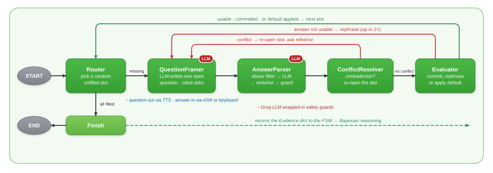
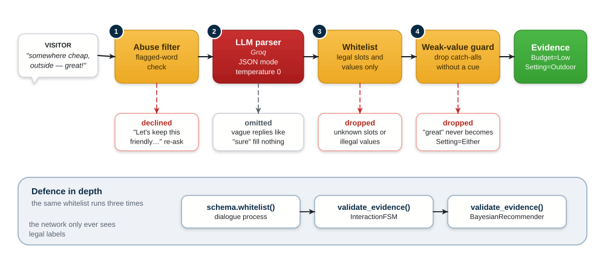
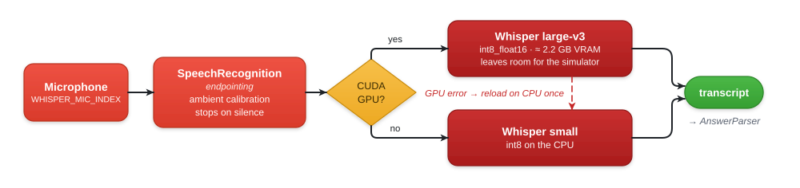

<sub>[Home](../README.md) › [Robot runtime](../src/README.md) · [Perception](../src/perception/README.md) · **Dialogue** · [Recommender](../src/recommender/README.md) · [Behaviour](../src/behaviour/README.md)</sub>

# Dialogue Service

The dialogue service holds the conversation. It asks open, natural questions,
interprets free-form answers with a language model, and returns a validated
`Evidence` dict of up to six preferences for the Bayesian recommender.

It is a standalone **Python 3.11** `uv` project, because LangGraph needs Python
3.9 or newer while the robot stack is pinned to 3.8. The robot drives it as a
subprocess through the [JSON-over-stdio bridge](../src/README.md#the-two-runtime-bridge).
It can also run on its own in a terminal or in LangGraph Studio.

---

## The agent graph

The conversation is a LangGraph `StateGraph` of five cooperating nodes. They
fill the six preference slots one at a time, and one rich answer can fill
several slots at once.

<p align="center">
  <picture>
    <source media="(prefers-color-scheme: dark)" srcset="../docs/diagrams/dialogue-graph-dark.svg">
    
  </picture>
</p>

<sub>Nodes with an <b>LLM</b> badge call the language model. The others are deterministic control logic.</sub>

| Node | Responsibility |
|---|---|
| **Router** | Picks the next unfilled slot **at random**, so conversations don't always open with the same question, or finishes when every slot is filled |
| **QuestionFramer** | Has the LLM write *one* short, open, experiential question about the target slot, using what is already known. It never reads out the options. A random style hint each turn varies the phrasing. If the LLM fails, it falls back to the slot's fixed question |
| **AnswerParser** | Turns the reply into candidate slot values, after the safety checks below |
| **ConflictResolver** | If the reply contradicts a committed value, it keeps the non-conflicting parts, re-opens that slot, and asks a short either/or question |
| **Evaluator** | Commits new values. If the target is still empty, asks again in a different way. If two rephrasings still fail, it applies the slot's default and tells the user |

<details>
<summary>The same graph as rendered by LangGraph</summary>


</details>

### Example: one answer fills three slots

```text
JARVIS:  What would make for a good outing for you this time?
You:     somewhere cheap outside with a few friends
         → Budget = Low · Setting = Outdoor · GroupSize = Small   (3 slots, 1 turn)
         Router skips those three and moves on to the remaining slots
```

---

## From free text to safe evidence

The LLM is used only as an **interface layer**. It never touches the network
structure or the probabilities. Each reply passes through a fixed chain of
checks before it can become evidence:

<p align="center">
  <picture>
    <source media="(prefers-color-scheme: dark)" srcset="../docs/diagrams/safety-chain-dark.svg">
    
  </picture>
</p>

| Guard | What it prevents |
|---|---|
| **Abuse filter** | A small flagged-word list (`_ABUSE_WORDS`) catches hostile replies, which are then declined politely instead of reaching the parser |
| **Prompt rules** | Vague or agreeable replies ("sure", "sounds good") fill nothing. Greetings like "good evening" never set `TimeOfDay`. Negation is respected: "not into music" is not `Music` |
| **Whitelist** | `schema.whitelist()` drops any slot or value the Bayesian network doesn't know |
| **Weak-value guard** | `Setting=Either` and `ActivityLevel=Moderate` are kept only if the user actually said something like "either", "don't care" or "flexible" |
| **Offline fallback** | Without a Groq key, a deterministic keyword parser (`ScriptedParser`) is used instead |

The whitelist runs again on the robot side (`validate_evidence`) and a third
time inside the recommender. **No value outside the six legal sets can reach
inference.**

### The six slots

| Slot | Values | Default | Example question the LLM might write |
|---|---|---|---|
| Budget | Low · Med · High | Med | "Would you prefer something more refined, or are you happy to keep it simple?" |
| GroupSize | Solo · Small · Large | Small | "Will it just be you this evening, or is anyone joining you?" |
| ActivityLevel | Relaxed · Moderate · Active | Moderate | "What kind of pace suits you tonight: relaxed, or something livelier?" |
| Setting | Indoor · Outdoor · Either | Either | *(generated each run)* |
| TimeOfDay | Day · Evening · Night | Evening | *(generated each run)* |
| Interest | Arts · Music · Food · Sports | Music | "Any particular interests I should factor in?" |

Defaults apply only after repeated unusable answers. Slots, fixed questions and
defaults live in [`dialogue/slots.py`](dialogue/slots.py). Adding or rewording a
question means editing only that table.

---

## Speech input

With `--answer speech`, replies are transcribed **on the device** by
[faster-whisper](https://github.com/SYSTRAN/faster-whisper). No audio leaves the
machine.

<p align="center">
  <picture>
    <source media="(prefers-color-scheme: dark)" srcset="../docs/diagrams/speech-input-dark.svg">
    
  </picture>
</p>

`int8_float16` lets `large-v3` fit on a 6 GB GPU and leaves headroom for the
qiBullet simulator. If GPU inference fails at runtime, the model reloads once on
the CPU and stays there.

---

## Setup

```bash
cd dialogue
uv sync                  # core: LangGraph, Groq client, tests
uv sync --extra speech   # optional: microphone + local Whisper (+ CUDA 12 runtime wheels)
```

## Configuration

Keys are read from the shared `src/.env` file at the repository root. A local
`dialogue/.env` overrides it.

| Variable | Default | Meaning |
|---|---|---|
| `GROQ_API_KEY` (or `GROK_KEY`) | — | Free key from [console.groq.com](https://console.groq.com). Without one, the offline keyword parser is used |
| `GROQ_MODEL` | `llama-3.1-8b-instant` | Any Groq chat model. Reasoning models are supported (their thinking is hidden) |
| `LANGSMITH_API_KEY` | — | Enables tracing. The variable must have exactly this name |
| `LANGSMITH_TRACING` | — | `"true"` to trace every run |
| `LANGSMITH_PROJECT` | — | Project name shown in LangSmith |
| `WHISPER_MODEL` | `large-v3` on GPU, `small` on CPU | `tiny` · `base` · `small` · `medium` · `large-v3` |
| `WHISPER_DEVICE` | `auto` | `cuda` or `cpu` |
| `WHISPER_COMPUTE` | `int8_float16` on GPU, `int8` on CPU | `float16` · `int8_float16` · `int8` |
| `WHISPER_MIC_INDEX` | system default | Input device index |
| `WHISPER_ENERGY` | calibrated | Fixed microphone energy threshold |

## Run on its own

```bash
# Offline and deterministic: no network, no microphone
uv run python -m dialogue.cli --llm scripted --input scripted --verbose

# Real Groq parsing, typed answers
uv run python -m dialogue.cli --llm groq --input text

# Real Groq parsing, spoken answers (needs --extra speech)
uv run python -m dialogue.cli --llm groq --input speech

# Interactive graph in LangGraph Studio
uv run langgraph dev
```

Add `--no-frame` to use the fixed questions instead of LLM-written ones.
[`RUNNING.md`](RUNNING.md) explains how to inspect runs in **LangSmith** and
**LangGraph Studio**.

## Test

```bash
uv run pytest -q
```

Three offline tests use the scripted parser and scripted input, so they need
no network or microphone:

- clear answers fill all six slots
- one reply fills several slots
- a default is applied after the clarification attempts run out

---

## Package layout

| Module | Contents |
|---|---|
| [`schema.py`](dialogue/schema.py) | Evidence labels and the `whitelist()` guard. Mirrors `src/contracts.py`, and the two must stay in sync |
| [`slots.py`](dialogue/slots.py) | The question plan: questions, clarifications, defaults, hints for the LLM |
| [`llm.py`](dialogue/llm.py) | `GroqEvidenceParser`, `GroqQuestionFramer`, and the offline `ScriptedParser` |
| [`graph.py`](dialogue/graph.py) | The LangGraph `StateGraph`, its nodes and routing, the abuse and weak-value guards |
| [`manager.py`](dialogue/manager.py) | `DialogueManager.collect_evidence()`, the public entry point |
| [`inputs.py`](dialogue/inputs.py) | Input providers: typed, speech, scripted, and Studio interrupt |
| [`asr.py`](dialogue/asr.py) | Local Whisper transcription with GPU/CPU selection |
| [`bridge.py`](dialogue/bridge.py) | Subprocess server for the robot bridge |
| [`cli.py`](dialogue/cli.py) | Terminal test harness |
| [`studio.py`](dialogue/studio.py) | Graph entry point for LangGraph Studio |

---

<sub>[← Perception](../src/perception/README.md) · Next: [Recommender →](../src/recommender/README.md)</sub>
