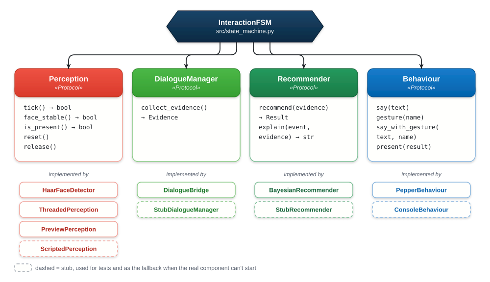
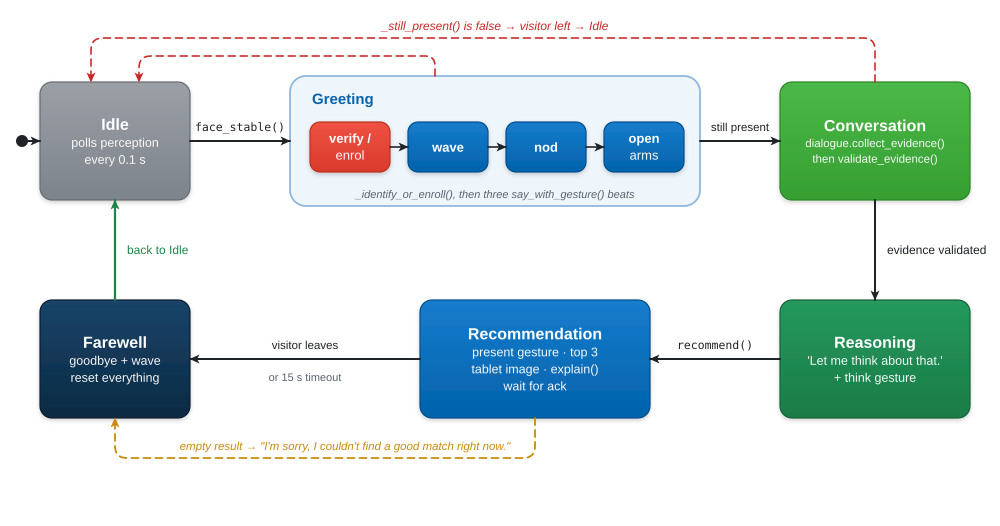
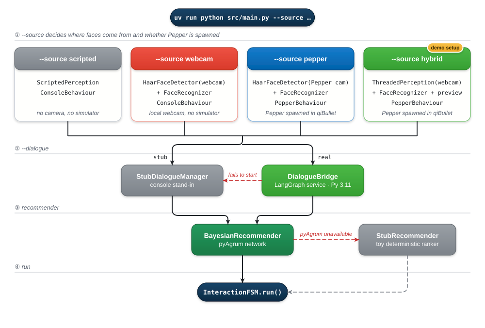
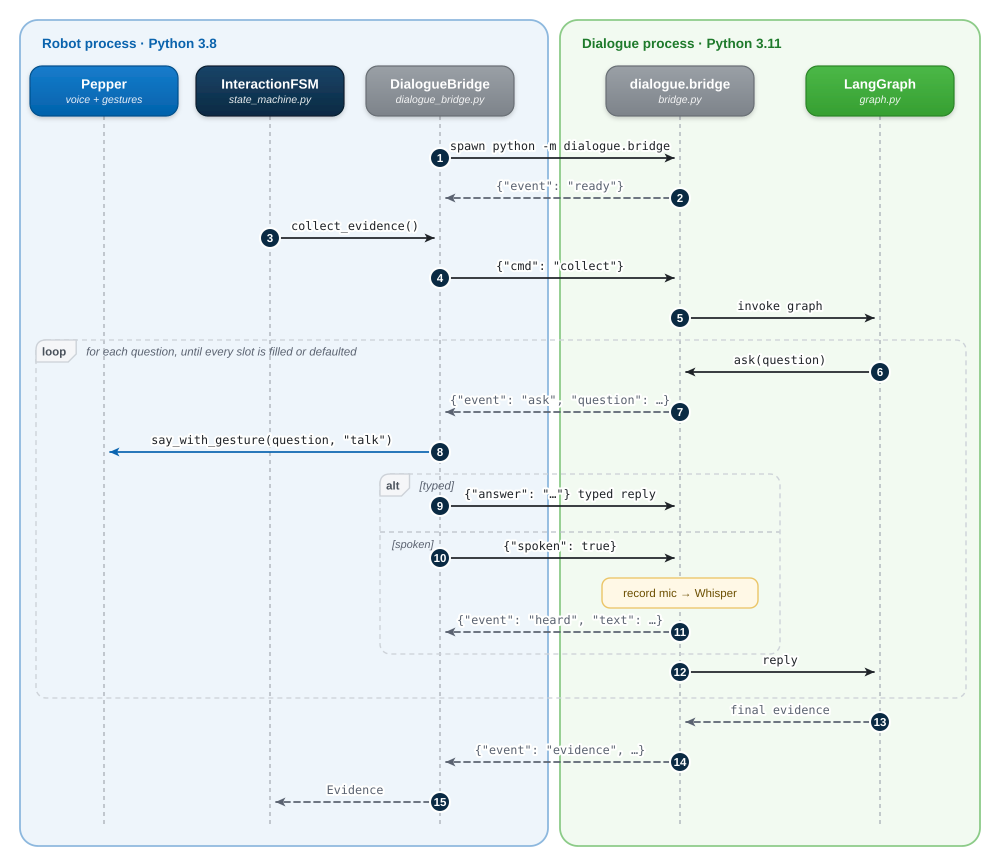

<sub>[Home](../README.md) › **Robot runtime and integration** · [Perception](perception/README.md) · [Dialogue](../dialogue/README.md) · [Recommender](recommender/README.md) · [Behaviour](behaviour/README.md)</sub>

# Robot Runtime and Integration

The `src/` folder is the robot half of JARVIS. It runs on **Python 3.8**, as
qiBullet and NAOqi require. It contains the entry point, the interaction state
machine that drives every encounter, the shared contracts that hold the parts
together, and the bridge client that talks to the Python 3.11 dialogue service.

| File | Role |
|---|---|
| [`main.py`](main.py) | Entry point: parses the CLI flags, builds the components for the chosen source, runs the FSM |
| [`state_machine.py`](state_machine.py) | `InteractionFSM`, the six-state interaction lifecycle, including face verification and enrollment |
| [`contracts.py`](contracts.py) | Shared types, the four component interfaces, the evidence whitelist, the agent's name and slogan |
| [`dialogue_bridge.py`](dialogue_bridge.py) | `DialogueBridge`, which spawns and drives the dialogue service over JSON stdio |
| [`stubs.py`](stubs.py) | Console and scripted stand-ins for dialogue, recommender and behaviour |
| [`check_perception.py`](check_perception.py) | Standalone diagnostic for face detection |
| [`enroll_face.py`](enroll_face.py) | Pre-enrolls a face offline (see [Perception](perception/README.md#offline-enrollment)) |

---

## Component contracts

The FSM uses the rest of the system only through four small `Protocol`
interfaces defined in [`contracts.py`](contracts.py). Any component can be
replaced by a stub, which let each work package run end-to-end from day one and
still lets every fallback work.

<p align="center">
  <picture>
    <source media="(prefers-color-scheme: dark)" srcset="../docs/diagrams/contracts-dark.svg">
    
  </picture>
</p>

Every component exchanges one data type, `Evidence`, a dict of up to six
preference slots:

```python
{"Budget": "Low", "GroupSize": "Small", "Interest": "Food"}   # partial evidence is fine
```

`validate_evidence()` keeps only legal slot and value pairs. It is the
robot-side half of the **LLM sandbox**: a language model can never pass the
Bayesian network a value it doesn't understand.

---

## The interaction state machine

<p align="center">
  <picture>
    <source media="(prefers-color-scheme: dark)" srcset="../docs/diagrams/fsm-dark.svg">
    
  </picture>
</p>

| State | Actions | Exits when |
|---|---|---|
| **Idle** | Polls perception every `idle_poll` seconds | A face is present in at least 4 of the last 5 frames |
| **Greeting** | Verifies the face, or asks name and consent (see [Perception](perception/README.md#face-verification-and-consent-based-enrollment)). Then three greeting beats, each a line and a gesture started together: wave, nod, open arms | Presence check passes, or the visitor has left |
| **Conversation** | `dialogue.collect_evidence()`, then `validate_evidence()` again on the robot side | Evidence returned, or the visitor has left |
| **Reasoning** | "Let me think about that." with the `think` pose, then `recommender.recommend()` | Ranking computed |
| **Recommendation** | `present` gesture, shows the top 3 and the tablet image, speaks `explain()`, waits for acknowledgement | Visitor leaves, or `ack_timeout` (15 s) passes |
| **Farewell** | "Enjoy your evening. JARVIS signing off, goodbye." with a `wave`, then resets | Always returns to Idle |

Every greeting and status line uses `say_with_gesture()`. It starts speech and
gesture together and returns only when **both** have finished, so each beat
plays as one coordinated unit (see [Behaviour](behaviour/README.md#coordinating-speech-and-gesture)).

---

## Run modes

`main.py` builds a different set of components for each `--source`:

<p align="center">
  <picture>
    <source media="(prefers-color-scheme: dark)" srcset="../docs/diagrams/run-modes-dark.svg">
    
  </picture>
</p>

| `--source` | Faces come from | Pepper body | Face verification | Typical use |
|---|---|---|---|---|
| `scripted` | A tick counter: the user "arrives" at tick 3 and "leaves" at tick 12 | No | No | Headless smoke test, CI-style runs, one cycle |
| `webcam` | Local webcam (`--camera-index`, `--preview`) | No | Yes | Testing perception and the dialogue without the simulator |
| `pepper` | Pepper's simulated head camera | Yes | Yes | Fully simulated run |
| `hybrid` | Local webcam, threaded with a live preview | Yes | Yes | **The demo setup**: a real face drives a simulated robot |

All flags:

| Flag | Default | Meaning |
|---|---|---|
| `--source` | `scripted` | See the table above |
| `--camera-index` | `0` | Webcam device index |
| `--preview` | off | Show the detection window (always on for `hybrid`) |
| `--headless` | off | Run qiBullet without its GUI |
| `--dialogue` | `stub` | `stub` (console) or `real` (LangGraph service) |
| `--answer` | `text` | With `--dialogue real`: `text` (typed) or `speech` (local Whisper) |
| `--interactive` | off | With the stub dialogue, ask multiple-choice questions on the console |
| `--max-cycles` | 1 for `scripted`, unlimited otherwise | Stop after N encounters |
| `--verbose` | off | Debug logging |

---

## The two-runtime bridge

LangGraph needs Python 3.9 or newer, but the robot stack is pinned to 3.8, so
the dialogue runs as a **separate process**. [`dialogue_bridge.py`](dialogue_bridge.py)
implements the `DialogueManager` contract by spawning
`dialogue/.venv/…/python -m dialogue.bridge` (or `uv run` as a fallback) and
exchanging **newline-delimited JSON over stdio**. The service's stdout carries
only protocol messages; all its logs go to stderr, which a daemon thread
drains.

The robot keeps control of the voice and camera, and the dialogue service keeps
control of language understanding:

<p align="center">
  <picture>
    <source media="(prefers-color-scheme: dark)" srcset="../docs/diagrams/bridge-sequence-dark.svg">
    
  </picture>
</p>

### Wire protocol

| Direction | Message | Meaning |
|---|---|---|
| service → robot | `{"event": "ready"}` | Handshake after startup |
| service → robot | `{"event": "ask", "question": "…"}` | Speak this question and return an answer |
| service → robot | `{"event": "listening"}` | Speech mode: the microphone is open |
| service → robot | `{"event": "heard", "text": "…"}` | Speech mode: what Whisper transcribed |
| service → robot | `{"event": "notify", "message": "…"}` | A status or clarification line to speak |
| service → robot | `{"event": "evidence", "evidence": {…}}` | Final result of a collection run |
| service → robot | `{"event": "error", "message": "…"}` | Collection failed |
| robot → service | `{"cmd": "collect"}` | Start a collection run |
| robot → service | `{"cmd": "quit"}` | Shut down |
| robot → service | `{"answer": "…"}` | Typed answer to the last `ask` |
| robot → service | `{"spoken": true}` | Pepper finished speaking: record and transcribe |

---

## Robustness and fallbacks

The runtime is built so that **a demo always completes**. Each failure falls
back to something simpler instead of crashing:

| Failure | Fallback |
|---|---|
| Dialogue service can't start (no venv, no `uv`) | Console `StubDialogueManager` |
| Bridge breaks mid-conversation | Empty evidence is returned, and the network still recommends from its priors |
| pyAgrum or the network can't be built | `StubRecommender`, a deterministic toy ranker |
| Recommendation is empty | JARVIS apologises and moves to Farewell |
| Visitor walks away | `_still_present()` checks between phases and returns to Idle |
| No camera source (`scripted`) | Face verification and enrollment are skipped |
| `Ctrl+C` | Caught, then `cleanup()` stops TTS, the camera and the simulator |

The full fallback matrix covering all components is in
[`TECHNICAL_DOCUMENTATION.md` §17](../TECHNICAL_DOCUMENTATION.md#17-robustness--fallback-matrix).

---

<sub>Next: [Perception →](perception/README.md)</sub>
