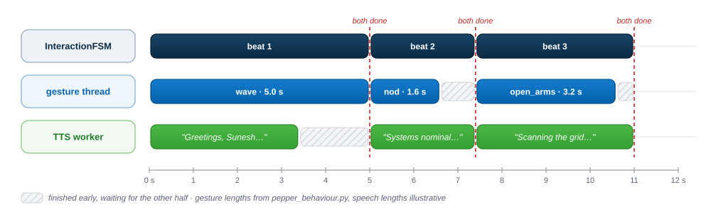
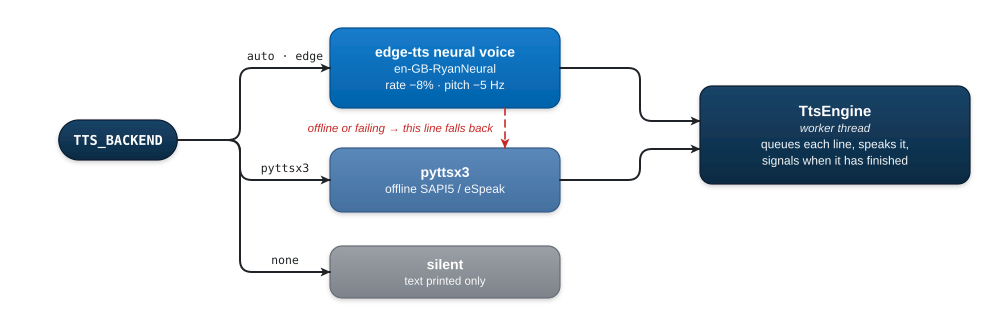
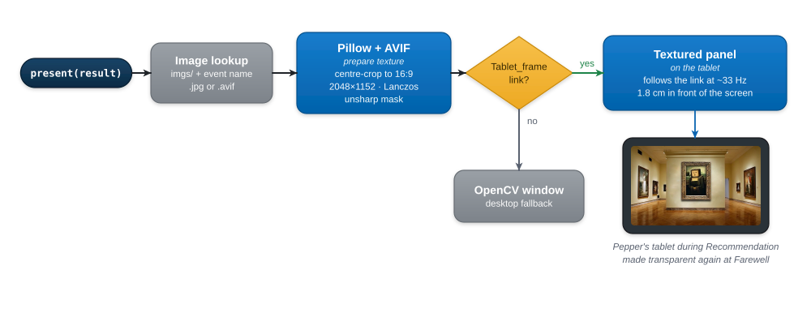
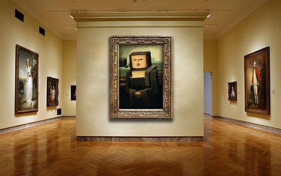
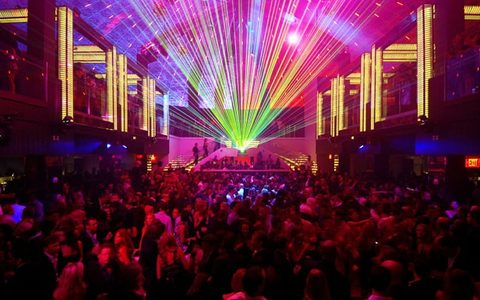
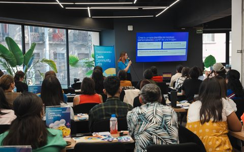

[Home](../../README.md) › [Robot runtime](../README.md) · [Perception](../perception/README.md) · [Dialogue](../../dialogue/README.md) · [Recommender](../recommender/README.md) · **Behaviour**

# Behaviour and Presentation

The behaviour layer is how JARVIS appears to the visitor: a natural voice, arm
and head gestures that match the speech, and the recommended event shown on
Pepper's tablet. It drives the simulated Pepper in qiBullet. Without a
simulator, `ConsoleBehaviour` (in [`../stubs.py`](../stubs.py)) prints the same
actions to the terminal.

| File | Contents |
|---|---|
| [`pepper_behaviour.py`](pepper_behaviour.py) | `PepperBehaviour`: speech, the gesture library, and coordinating the two |
| [`tts.py`](tts.py) | `TtsEngine`: a speech worker thread with a neural voice and offline fallback |
| [`event_display.py`](event_display.py) | `EventImageDisplay`: shows the event image on Pepper's tablet, with a window fallback |
| [`tablet_panel.obj`](tablet_panel.obj) | Flat mesh used as the image surface on the tablet |

---

## Coordinating speech and gesture

`say_with_gesture(text, gesture)` is the basic action of every visible beat.
It starts the gesture on its own thread, speaks at the same time, and returns
only when **both** have finished. The next line therefore never starts over an
unfinished movement.

  <picture>
    <source media="(prefers-color-scheme: dark)" srcset="../../docs/diagrams/speech-gesture-dark.svg">
    
  </picture>

### Gesture library

All gestures are joint-angle sequences sent through qiBullet's `setAngles`.
Each one ends by returning the arms to a neutral rest pose.

| Gesture | Movement | Duration | Used for |
|---|---|---|---|
| `wave` | Both arms to shoulder height, right arm up, elbow waves 3 times | ≈ 5.0 s | Greeting beat 1, farewell |
| `nod` | Head pitches down and up twice | ≈ 1.6 s | Greeting beat 2, notices such as defaults and the abuse prompt |
| `open_arms` | Forearms raised, hands open near the shoulders, small swings | ≈ 3.2 s | Greeting beat 3 |
| `talk` | One short beat: arms lift, right hand opens and closes | ≈ 1.25 s | **Every conversation question** |
| `think` | Right hand to chin, head tilted | ≈ 2.3 s | Reasoning |
| `present` | Right arm forward, palm open | ≈ 2.3 s | Recommendation |

> **Why a separate `talk` gesture?** The LLM writes questions of different
> lengths. The longer `open_arms` gesture often finished early, leaving Pepper
> standing still while still talking, or ran on past a short question.
> `talk` is short enough to stay in sync with any question length.

---

## Voice

  <picture>
    <source media="(prefers-color-scheme: dark)" srcset="../../docs/diagrams/voice-dark.svg">
    
  </picture>

Speech is queued on a dedicated **worker thread**, so it can run alongside a
gesture. The default voice is the stock Edge *Ryan* voice, slowed down and
lowered slightly to suit JARVIS's composed character. If the neural voice
fails partway through a run, that line is spoken by `pyttsx3` instead and the
demo carries on.

### Configuration

| Variable | Default | Meaning |
|---|---|---|
| `TTS_BACKEND` | `auto` | `edge` (neural) · `pyttsx3` (offline) · `none` |
| `TTS_VOICE` | `en-GB-RyanNeural` | Any Edge neural voice name |
| `TTS_RATE` | `-8%` | Speaking-rate offset, e.g. `+10%` |
| `TTS_PITCH` | `-5Hz` | Pitch offset, e.g. `+10Hz` |

The neural voice needs internet access. For a fully offline run, set
`TTS_BACKEND=pyttsx3`.

---

## Tablet display

qiBullet models Pepper's tablet as a link (`Tablet_frame`) but has no API to
display images on it. `EventImageDisplay` works around this:

  <picture>
    <source media="(prefers-color-scheme: dark)" srcset="../../docs/diagrams/tablet-display-dark.svg">
    
  </picture>

- The panel **follows the tablet link** as Pepper moves, so the image stays in
  place during gestures.
- It sits **1.8 cm in front** of the built-in black tablet surface. Without
  that offset, the image would be hidden inside the tablet.
- Two of the images are **AVIF**, which neither stock Pillow nor OpenCV can
  decode. Importing `pillow-avif-plugin` registers a decoder for them.

### The eight event images

<table>
  <tr>
    <td align="center"> <b>Museum</b></td>
    <td align="center"> <b>Concert</b></td>
    <td align="center"> <b>Sports</b></td>
    <td align="center"> <b>Food</b></td>
  </tr>
  <tr>
    <td align="center"> <b>Outdoor</b></td>
    <td align="center"> <b>Nightlife</b></td>
    <td align="center"> <b>Workshop</b></td>
    <td align="center"> <b>Networking</b></td>
  </tr>
</table>

Thumbnails for this page are in `docs/img/events/`. Pepper uses the full-size originals in `imgs/`.

---

[← Recommender](../recommender/README.md) · [Back to the main README ↑](../../README.md)
