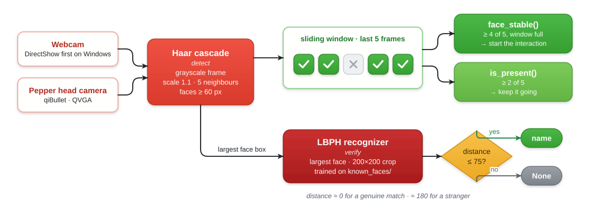
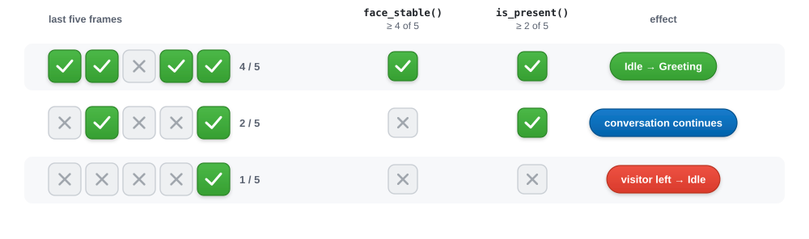
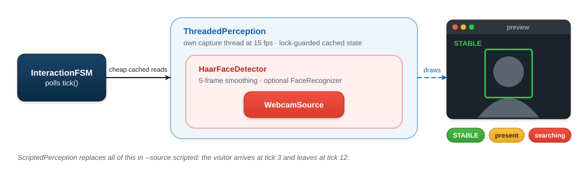
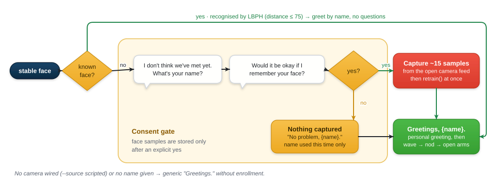

<sub>[Home](../../README.md) › [Robot runtime](../README.md) · **Perception** · [Dialogue](../../dialogue/README.md) · [Recommender](../recommender/README.md) · [Behaviour](../behaviour/README.md)</sub>

# Perception

Perception answers three questions for the interaction state machine: *Has
someone arrived? Are they still here? Who are they?* It uses only OpenCV and
runs entirely on the device. No image ever leaves the machine.

| File | Contents |
|---|---|
| [`face_detector.py`](face_detector.py) | Frame sources, `HaarFaceDetector` with temporal smoothing, the `PreviewPerception` and `ThreadedPerception` wrappers, `ScriptedPerception` |
| [`face_recognizer.py`](face_recognizer.py) | `FaceRecognizer`, which does LBPH face verification and saves enrollment samples |
| [`../enroll_face.py`](../enroll_face.py) | CLI to pre-enroll a person offline |
| [`../check_perception.py`](../check_perception.py) | Diagnostic that shows a live detection window with the smoothing status |

---

## Pipeline

<p align="center">
  <picture>
    <source media="(prefers-color-scheme: dark)" srcset="../../docs/diagrams/perception-pipeline-dark.svg">
    
  </picture>
</p>

### Two thresholds, one window

Raw Haar detections flicker from frame to frame. `HaarFaceDetector` stores the
last five detection results and applies **two different thresholds** to them:

| Check | Rule | Purpose |
|---|---|---|
| `face_stable()` | Window full **and** a face in at least 4 of 5 frames | Strict: a passer-by or a single false positive won't start an interaction |
| `is_present()` | A face in at least 2 of 5 frames | Lenient: a brief missed detection mid-conversation doesn't count as the visitor leaving |

<p align="center">
  <picture>
    <source media="(prefers-color-scheme: dark)" srcset="../../docs/diagrams/smoothing-dark.svg">
    
  </picture>
</p>

### Wrappers

The detector can be wrapped without the FSM noticing, since every wrapper
implements the same `Perception` contract:

<p align="center">
  <picture>
    <source media="(prefers-color-scheme: dark)" srcset="../../docs/diagrams/perception-wrappers-dark.svg">
    
  </picture>
</p>

- **`ThreadedPerception`** captures frames and draws the preview on a background
  thread. Without it, the preview window freezes whenever the FSM blocks, for
  example while Pepper is talking or waiting for an answer. Used in `hybrid` mode
  and with `--preview`.
- **`PreviewPerception`** draws the same preview, but only when the FSM calls
  `tick()`. It is a lighter decorator for single-threaded use.
- **`ScriptedPerception`** is camera-free: the "visitor" arrives at tick 3 and
  leaves at tick 12. Used by `--source scripted` and the tests.

---

## Face verification and consent-based enrollment

When a real camera is in use, the Greeting state checks who the visitor is
before saying anything personal. If JARVIS doesn't know the visitor, it asks
for a name and **explicit consent** before storing any face data:

<p align="center">
  <picture>
    <source media="(prefers-color-scheme: dark)" srcset="../../docs/diagrams/enrollment-dark.svg">
    
  </picture>
</p>

Design notes:

- **LBPH** (Local Binary Patterns Histograms, from `cv2.face` in
  `opencv-contrib-python`) works with a handful of samples per person and needs
  no GPU or network. Its score is a *distance*, so lower is better. Measured
  values: about 0 for a genuine match, about 180 for a stranger. The threshold
  of 75 leaves a wide margin on both sides.
- Enrollment **reuses the camera feed the FSM already has open**, so a second
  connection never competes for the webcam.
- The recognizer **retrains immediately**, so a newly enrolled visitor is
  recognised on their next visit without a restart.
- Samples are saved to `src/perception/known_faces/{name}/NNN.jpg`. That folder is
  **git-ignored** because it holds biometric data and must never be committed.

### Offline enrollment

People can also be enrolled before a demo:

```bash
uv run python src/enroll_face.py --name Alex                       # 20 samples, webcam 0
uv run python src/enroll_face.py --name Alex --count 30 --camera-index 1
```

| Flag | Default | Meaning |
|---|---|---|
| `--name` | required | Folder name under `known_faces/` |
| `--count` | `20` | Number of samples to save |
| `--camera-index` | `0` | Webcam index |
| `--interval` | `0.3` | Seconds between captures |

The CLI and live enrollment use the same detector and the same 200×200
preprocessing, so samples from either path can be combined.

---

## Diagnostics

Check that detection works before running the full agent:

```bash
uv run python src/check_perception.py --source webcam              # live window with boxes and status
uv run python src/check_perception.py --source pepper              # Pepper's simulated camera
uv run python src/check_perception.py --source webcam --no-window  # status lines only (headless or SSH)
```

> **Windows note.** OpenCV's default MSMF backend often opens a webcam but then
> fails to return frames. `WebcamSource` tries **DirectShow** first and accepts a
> backend only after it has actually read a frame.

---

<sub>[← Robot runtime](../README.md) · Next: [Dialogue →](../../dialogue/README.md)</sub>
