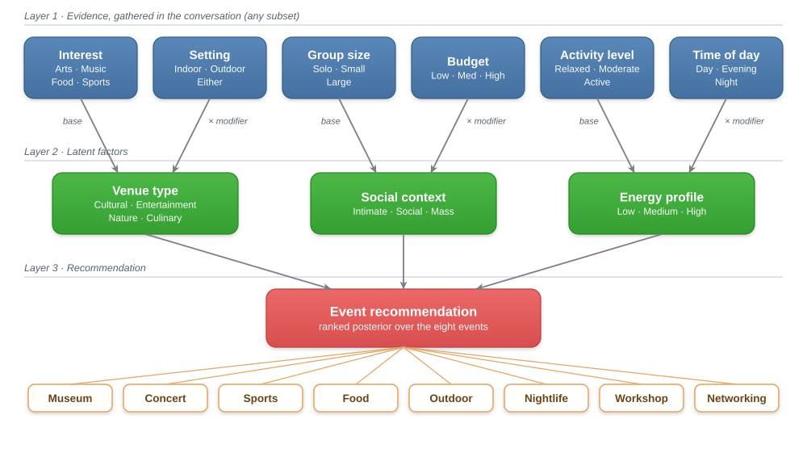
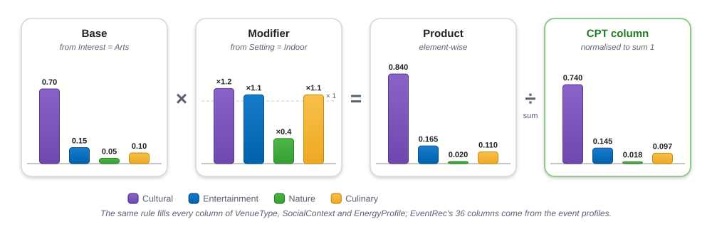
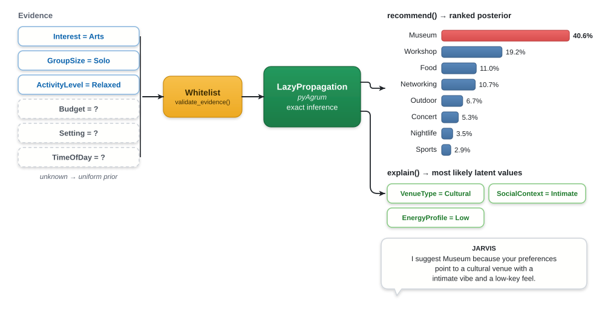

<sub>[Home](../../README.md) › [Robot runtime](../README.md) · [Perception](../perception/README.md) · [Dialogue](../../dialogue/README.md) · **Recommender** · [Behaviour](../behaviour/README.md)</sub>

# Bayesian Recommender

The recommender turns up to six discrete preferences into a ranked probability
distribution over eight social events. It also gives a one-sentence reason for
its choice. It is a small three-layer **Bayesian network** built with
[pyAgrum](https://agrum.gitlab.io/). A Bayesian network was chosen over a
learned scorer because every step can be read and explained, and because it
copes naturally with **missing evidence**.

Source: [`bayesian_network.py`](bayesian_network.py) · Tests: [`tests/test_recommender.py`](../../tests/test_recommender.py)

---

## Network topology

Each **pair** of observed preferences feeds one interpretable latent factor.
The three factors together decide the event.

<p align="center">
  <picture>
    <source media="(prefers-color-scheme: dark)" srcset="../../docs/diagrams/bayesian-network-dark.svg">
    
  </picture>
</p>

| Latent factor | Parents | Question it answers |
|---|---|---|
| **VenueType** | Interest (base) × Setting (modifier) | *What kind of place?* |
| **SocialContext** | GroupSize (base) × Budget (modifier) | *How social should it feel?* |
| **EnergyProfile** | ActivityLevel (base) × TimeOfDay (modifier) | *How much energy?* |

The six evidence nodes have **uniform priors**, so a preference that was never
asked about has no influence on the result.

---

## How the probability tables are built

The conditional probability tables (CPTs) are **generated from soft,
human-readable rules** rather than written out by hand. This keeps 36 + 27 + 36
columns consistent with each other and easy to adjust.

<p align="center">
  <picture>
    <source media="(prefers-color-scheme: dark)" srcset="../../docs/diagrams/cpt-generation-dark.svg">
    
  </picture>
</p>

The `EventRec` CPT is generated from **event profiles**: the latent values each
event "likes". For every one of the 4 × 3 × 3 = 36 latent combinations, each
event scores the product of three factors. Each factor is `1.0` when the event
matches that dimension and a penalty otherwise (0.20 for venue, 0.25 for social,
0.25 for energy). A `1e-3` floor avoids hard zeros, and the scores are then
normalised.

| Event | Venue | Social | Energy |
|---|---|---|---|
| Museum | Cultural | Intimate, Social | Low |
| Concert | Entertainment | Social, Mass | Medium |
| Sports | Entertainment | Mass | High |
| Food | Culinary | Social, Mass | Low, Medium |
| Outdoor | Nature | Intimate | High |
| Nightlife | Entertainment | Social | High |
| Workshop | Cultural | Intimate | Medium |
| Networking | Cultural, Entertainment | Social | Medium |

<details>
<summary>All base and modifier tables</summary>

**Interest → VenueType (base)**

| Interest | Cultural | Entertainment | Nature | Culinary |
|---|---|---|---|---|
| Arts | 0.70 | 0.15 | 0.05 | 0.10 |
| Music | 0.15 | 0.70 | 0.05 | 0.10 |
| Food | 0.10 | 0.10 | 0.10 | 0.70 |
| Sports | 0.05 | 0.55 | 0.35 | 0.05 |

**Setting → VenueType (modifier)**

| Setting | Cultural | Entertainment | Nature | Culinary |
|---|---|---|---|---|
| Indoor | 1.2 | 1.1 | 0.4 | 1.1 |
| Outdoor | 0.7 | 0.9 | 2.5 | 0.9 |
| Either | 1.0 | 1.0 | 1.0 | 1.0 |

**GroupSize → SocialContext (base)**

| GroupSize | Intimate | Social | Mass |
|---|---|---|---|
| Solo | 0.75 | 0.20 | 0.05 |
| Small | 0.40 | 0.50 | 0.10 |
| Large | 0.05 | 0.45 | 0.50 |

**Budget → SocialContext (modifier)**

| Budget | Intimate | Social | Mass |
|---|---|---|---|
| Low | 1.1 | 1.0 | 0.9 |
| Med | 1.0 | 1.0 | 1.0 |
| High | 1.0 | 1.05 | 1.1 |

**ActivityLevel → EnergyProfile (base)**

| ActivityLevel | Low | Medium | High |
|---|---|---|---|
| Relaxed | 0.70 | 0.25 | 0.05 |
| Moderate | 0.20 | 0.60 | 0.20 |
| Active | 0.05 | 0.30 | 0.65 |

**TimeOfDay → EnergyProfile (modifier)**

| TimeOfDay | Low | Medium | High |
|---|---|---|---|
| Day | 1.1 | 1.0 | 0.9 |
| Evening | 1.0 | 1.1 | 1.0 |
| Night | 0.8 | 1.0 | 1.3 |

</details>

---

## Inference and explanation

<p align="center">
  <picture>
    <source media="(prefers-color-scheme: dark)" srcset="../../docs/diagrams/inference-dark.svg">
    
  </picture>
</p>

- **`recommend(evidence)`** returns all eight events sorted by probability, as
  `[{"event": "Museum", "prob": 0.41}, …]`. Pepper presents the top three.
- **`explain(event, evidence)`** reads back the most likely latent values and
  phrases them as the sentence Pepper speaks.

With **no evidence at all**, the distribution is almost flat (Food 18.8%,
Museum 14.6%, … Sports 8.9%). Each answer narrows it down.

---

## Try it

```bash
uv run python src/recommender/bayesian_network.py   # four sample profiles, top 3 and explanation
uv run pytest tests/test_recommender.py -v          # 7 tests
```

| Test | Checks |
|---|---|
| `test_returns_all_events_as_normalised_distribution` | Empty evidence gives 8 events that sum to 1, sorted |
| `test_arts_solo_relaxed_favours_museum` | Museum is in the top 2 |
| `test_food_outdoor_favours_food` | Food ranks first |
| `test_active_night_large_sporty_is_high_energy` | Sports or Nightlife is in the top 3 |
| `test_partial_evidence_supported` | A single slot still gives a valid distribution |
| `test_explain_mentions_event` | The explanation names the event |
| `test_invalid_values_ignored` | Illegal values such as `Budget="Bananas"` are dropped, not crashed on |

---

<sub>[← Dialogue](../../dialogue/README.md) · Next: [Behaviour →](../behaviour/README.md)</sub>
